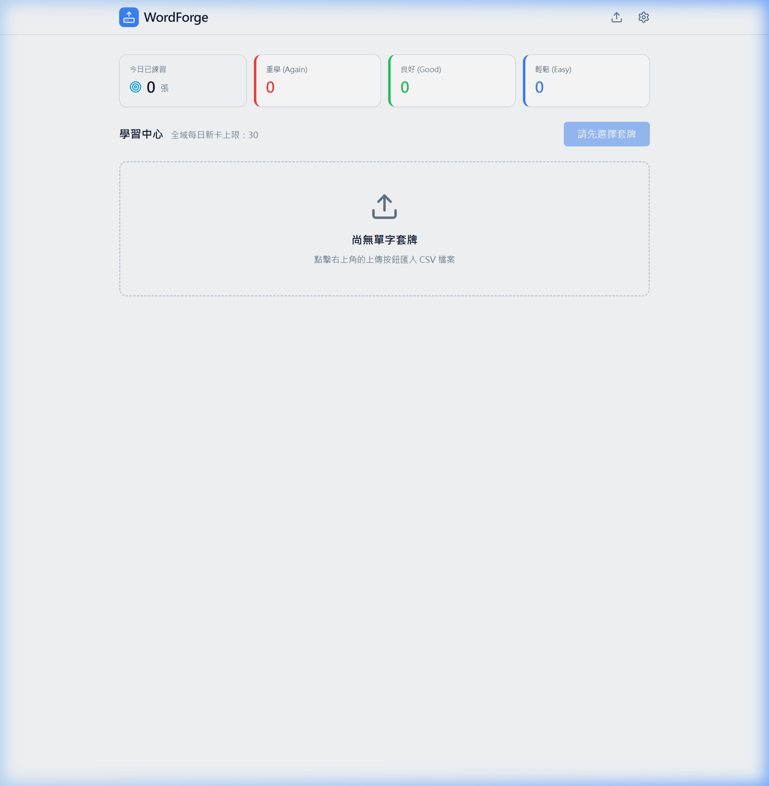

# WordForge SRS

A local-first Spaced Repetition System (SRS) powered by the SM-2 algorithm for efficient language learning.

## Introduction

WordForge SRS is a digital flashcard tool designed for high-efficiency memorization. It utilizes the scientific SM-2 algorithm to dynamically adjust review intervals based on your forgetting curve.

- **SM-2 Algorithm Engine**: Automatically calculates optimal review intervals based on card interaction history (`Again` / `Hard` / `Good` / `Easy`).
- **Local-First Storage**: All vocabulary data and learning progress are stored in the browser's IndexedDB, ensuring privacy and offline accessibility.
- **PWA Support**: Built-in Service Worker for asset caching, enabling a stable native app-like experience in offline environments.
- **Robust Import**: Supports bulk CSV uploads with row-level diagnostic messaging and strict format validation.
- **Flexible Quotas**: Individually configurable global daily new card limits and per-deck independent quotas.

## Installation

Ensure you have [Node.js](https://nodejs.org/) installed.

### Local Development Setup
1. **Clone the repository**:
   ```bash
   git clone <repository-url>
   cd wordcards
   ```
2. **Install dependencies**:
   ```bash
   npm install
   ```
3. **Start the development server**:
   ```bash
   npm run dev
   ```

### Testing & Verification
- **Run Playwright E2E tests**:
  ```bash
  npx playwright test
  ```

### Deployment
The project utilizes GitHub Actions (`.github/workflows/deploy.yml`) triggered upon pushes to the `main` branch for automated deployment to GitHub Pages.

## Usage

### Importing Vocabulary
WordForge is local-first. The import button is located in the top-right corner of the dashboard:

1. Prepare a CSV file in the format: `front text,back text`.
2. Click the **"Import CSV"** button to upload.

### PWA Installation Guide (Recommended)
For the best experience (full-screen mode, faster startup), please install the Web App:
- **iOS (Safari)**: Tap the **"Share"** button 📤 and select **"Add to Home Screen"**.
- **Android (Chrome)**: Tap the menu **(⋮)** and select **"Install app"** or **"Add to Home screen"**.
- **Desktop (Chrome/Edge)**: Click the **"Install"** icon in the address bar.

## Tech Stack

- **Frontend**: React 19, TypeScript
- **Build Tool**: Vite
- **UI Styling**: Tailwind CSS v3, Lucide-React
- **Storage**: IndexedDB (Native API wrapper)
- **Data Parsing**: PapaParse (Client-side CSV parsing)
- **Offline Support**: Progressive Web App (PWA)
- **Deployment**: GitHub Actions, GitHub Pages
